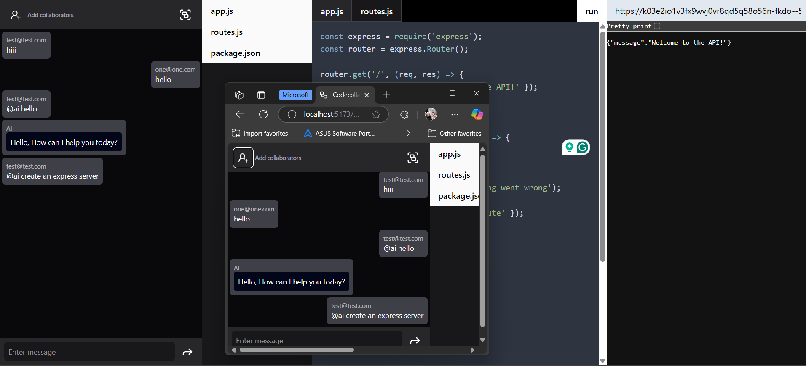

# CAKE ( Collaborative - AI-assisted - Koding - Environment )


## Overview
The **Collaborative Coding Application** is a real-time, AI-powered code collaboration platform. Users can:
- Add collaborators to a project
- Chat in real time
- Ask AI to generate and assist with code
- Preview AI-generated code and files
- Execute code inside the browser using WebContainers

### Deployment
- frontend - vercel
- backend - render -
will takes time to respond, so be patient, sry for inconvinience :) 

## Features
- **Real-Time Collaboration**: Work with multiple developers on the same project simultaneously.
- **AI-Assisted Coding**: Ask AI to generate and optimize code snippets.
- **Live Chat**: Communicate with team members instantly.
- **Code Execution with WebContainers**: Run and preview code directly in the browser.
- **Authentication & Security**: Secure user authentication with JWT and bcrypt.
- **Real-Time Updates**: Instant changes reflected using WebSockets.

## App Preview



---

## Tech Stack


### **Frontend** (React & Vite)
- **UI**: React, TailwindCSS, Lucide React
- **Code Execution**: WebContainers API
- **Routing**: React Router
- **Markdown Support**: markdown-to-jsx
- **Syntax Highlighting**: highlight.js
- **WebSockets**: socket.io-client
- **HTTP Requests**: axios

### **Backend** (Node.js & Express)
- **Web Framework**: Express.js
- **Database**: MongoDB with Mongoose
- **Authentication**: JWT, bcrypt
- **Real-Time Communication**: Socket.io
- **AI Integration**: Google Generative AI
- **Caching**: Redis (ioredis)
- **Environment Management**: dotenv
- **Middleware**: Cookie-parser, CORS, Morgan

---

## Installation & Setup
### **Prerequisites**
Ensure you have the following installed:
- Node.js (Latest LTS Version)
- MongoDB (For database storage)

### **Backend Setup**
1. Clone the repository:
   ```sh
   git clone https://github.com/your-repo/collaborative-coding.git
   cd collaborative-coding/backend
   ```
2. Install dependencies:
   ```sh
   npm install
   ```
3. Create a `.env` file and configure:
   ```sh
   PORT=5000
   MONGO_URI=your_mongodb_uri
   JWT_SECRET=your_jwt_secret
   ```
4. Start the backend server:
   ```sh
   npm start
   ```

### **Frontend Setup**
1. Navigate to the frontend directory:
   ```sh
   cd ../frontend
   ```
2. Install dependencies:
   ```sh
   npm install
   ```
3. Start the frontend server:
   ```sh
   npm run dev
   ```

---

## Usage
- Open `http://localhost:3000` to access the application.
- Sign up or log in to start a collaborative session.
- Invite collaborators and start coding together.
- Use the chat feature to communicate in real time.
- Ask AI for coding suggestions or improvements.
- Preview and execute code inside the browser.

---

## Contributing
1. Fork the repository.
2. Create a feature branch:
   ```sh
   git checkout -b feature-name
   ```
3. Commit your changes:
   ```sh
   git commit -m "Added a new feature"
   ```
4. Push to the branch:
   ```sh
   git push origin feature-name
   ```
5. Create a Pull Request.

---

## License
This project is licensed under the [MIT License](LICENSE).

